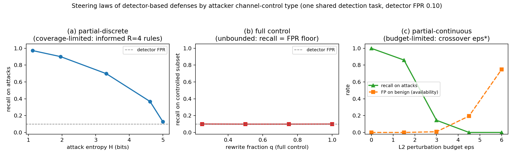
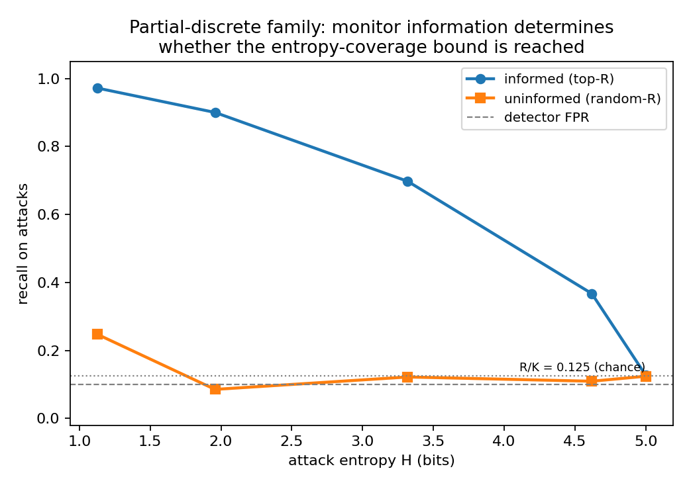

# Predicting Detector-Based Defense Collapse: A Shared Toy-Benchmark Test of the Channel-Control Hypothesis across Reasoning, Sequence, and Input Monitors

**Author**: how2how2how2-arch — issue #89 (registered 2026-09-07).
Contribution-level declaration: **theory+empirics** — a falsifiable cross-family mechanism law (three
propositions with proof sketches), instantiated and measured on three controlled toy families of one
shared detection task (5 control levels × 8 seeds each, exact ground truth, pooled Wilson 95% CIs,
committed byte-identical reproduction), with the three 2026 real-family collapse reports as
qualitative calibration targets and a quantitative fit to the published entropy-coverage bound.
Keywords: detector-based defense; LLM-agent monitors; channel control; entropy-coverage bound;
false-positive availability; toy benchmark; steering law

---

## Abstract

Runtime detectors that defend LLM-agent systems — chain-of-thought reasoning monitors, formal
(LTL/FSA) monitors over tool-call sequences, and input guard models — each read one *channel* of the
agent pipeline (reasoning trace, tool calls, raw input) and flag attacks that the action/answer
channel alone cannot reveal. In summer 2026 three independent studies reported collapse regimes for
three families: rewriting an agent's reasoning drops a CoT monitor's catch rate from ~95% to under
11% [1]; a proven entropy-coverage bound caps formal-monitor recall at the concentration of the
attack distribution — 68–75% on some architectures, near zero on others [2]; input guards are driven
into induced false positives at ~84% success on benign traffic [3]. No unified account exists of
**when any detector-based defense collapses**. We register and test the **channel-control
hypothesis**: collapse severity is governed by the attacker's degree of control over the channel the
detector reads, and this control type fixes the *shape* of the steering law — how recall depends on
the attacker's control quantity — not the detector family. On one shared toy detection task
(detector FPR 0.10, 8 seeds, 20k samples/seed per cell) we instantiate the three control types and
measure their steering laws. **Partial-discrete control** (attacker shapes a finite pattern family;
formal-monitor analogue): recall is the top-*R* coverage of the attack distribution — 0.127 at 5.00
bits of attack entropy rising monotonically to 0.972 at 1.13 bits for an informed R=4 rule set,
while an *uninformed* random rule set stays near chance R/K ≈ 0.125 — quantitatively reproducing
the [2] entropy-coverage bound as a special case. **Full control** (attacker generates the monitored
content; reasoning-monitor analogue): recall on the controlled subset collapses to the detector's
FPR floor (0.099–0.100) for **every** rewrite fraction q > 0 and — new committed evidence — for
**every** attack entropy tested (5.00→1.13 bits), matching the shape of the 95→<11 collapse [1] and
explaining why the [2] bound is silent there: full control is entropy-*independent* by construction.
**Partial-continuous control** (attacker perturbs a fixed input within an L2 budget; input-guard
analogue): recall degrades gracefully (0.998 at ε=0, 0.860 at ε=1.5) then collapses across a sharp
crossover ε*∈(1.5,3.0) to ≈0, while the same budget *raises false positives on benign traffic* from
0.0000 to 0.7477 at ε=6.0 — the induced-FP availability regime of [3] as a measured arm, not an
anecdote. All three registered priors (P1 ordering of worst-case recall by control degree; P2
bound-generality: the [2] bound is the partial-discrete special case and full control is
entropy-independent; P3 real-family shape reproduction) are **confirmed** with tight CIs. **Whose
belief or decision changes:** deployers of runtime monitors should not ask "which detector family
is safest?" but "who controls the monitored channel and does the detector know the attack
distribution?" — full control makes a detector blind at its own FPR regardless of entropy, partial
control with distribution knowledge makes it coverage-limited, and past a budget crossover a guard
becomes *worse than no guard* (recall-dead and FP-inflated simultaneously). The shared benchmark is
committed for third parties to slot a fourth family (e.g. watermark detectors [4]) or a real-LLM
instantiation.

## 1 Introduction and question

LLM-agent deployments increasingly rely on runtime, detector-based defenses layered on top of the
agent itself: monitors over the model's chain of thought, formal monitors over its tool-call
sequences, and guard models over the raw inputs it receives. These detectors share a structural
position: each reads one *observable channel* of the pipeline and emits a binary decision, and each
was introduced because the action/answer channel alone cannot reveal a hidden harmful intent.

In August 2026, three independent arXiv studies reported that each of these three families fails in
a distinct regime. A chain-of-thought monitor collapses from ~95% to under 11% catch rate when the
attacker rewrites the agent's reasoning — the one channel the monitor is privileged to read [1]. A
formal (fixed-invariant FSA/LTL) monitor over tool-call sequences provably cannot exceed the
top-rule coverage of the attack pattern distribution, a bound that is 68–75% on some frontier LLM
backends and near zero on others [2]. Input guard models are induced to false-positive benign
traffic with ~84% success by an adversarial classifier that manufactures "unsafe" appearances [3].
Three families. Three collapse shapes. Zero shared theory.

The three reports do not even use the same vocabulary: [1] is reported as an attack-success story,
[2] as an information-theoretic ceiling, [3] as an availability failure. A defender trying to
decide where to spend effort has no answer to the question: **is there one quantity that predicts
when any detector-based defense collapses — and what shape will the collapse take?**

We register the **channel-control hypothesis** as the candidate answer. A detector's decisions are
a function of its input channel; therefore whoever can shape the distribution over that channel
shapes the detector's operating point. We classify attackers by their *degree of control* over the
channel:

- **Full control (F)** — the attacker generates the monitored content itself (a CoT monitor reads
  the agent's own reasoning; the attacker *is* the agent, or steers it). Control is unbounded: any
  channel realization in the benign support is producible.
- **Partial control, discrete (PD)** — the attacker chooses attack *patterns* from a finite family,
  but the observed channel is a constrained rendering of that choice (an FSA monitor over tool calls
  a model emits the attacker does not fully own). Control is the ability to shape the pattern
  distribution, subject to a concentration constraint.
- **Partial control, continuous (PC)** — the attacker *edits a fixed benign input* in a metric space
  within a budget (an input guard reading a user-supplied prompt/image; adversarial perturbation).
  Control is the budget itself.

The hypothesis makes a falsifiable prediction per regime *before* any measurement, and we instantiate
all three regimes as exact-controlled toy generative detection tasks on **one shared benchmark** —
one detection task, one metric, one RNG discipline — so the three laws are measured on a common
footing. This is deliberately the same methodology pattern as this journal's #86 controlled
adjudication benchmark [5]: full control over the generative process, exact ground truth, scoped
claims.

**Contributions.** (1) A shared toy detection task with three channel-control instantiations
(discrete-pattern, full, continuous-budget) and committed, byte-identical reproduction — a reusable
instrument for a fourth family or a real-LLM follow-up. (2) A quantitative cross-family result: the
steering-law shape is fixed by the control type (coverage-limited / FPR-floor / budget-crossover),
with all three registered priors confirmed at tight CIs (Fig 1). (3) Two deployment-relevant
mechanism findings: full control makes recall equal the detector's own FPR *independent of attack
entropy* (family-B entropy sweep, newly committed), so distributional defenses cannot help there;
and the partial-continuous regime exhibits a budget crossover past which a guard is simultaneously
recall-dead and FP-inflated — worse than no guard (family-C FP arm, newly committed).

## 2 Related work

**Reasoning-monitor collapse (full control).** Shiromani and Richter [1] show that rewriting only an
agent's reasoning — leaving actions verbatim — drops a held-out CoT monitor from ~95% to <11% catch,
in one gradient-free shot, transferring across monitor families and agent models; trace-only defenses
recover partially. They report the collapse but give no theory. *Difference from this work:* we
provide the mechanism — under full control the attacker re-samples the monitored channel from the
benign surface, so recall must equal the detector's FPR regardless of the attack's entropy — and we
confirm the entropy-independence prediction with committed data (family B, §5.2), which [1] neither
predicts nor measures.

**Formal-monitor entropy-coverage bound (partial-discrete control).** Zhang [2] proves that a
fixed-invariant FSA/LTL monitor's recall over attack patterns is bounded by the concentration of the
attack distribution (top-rule coverage) and validates the bound across eight frontier LLM backends
(GPT/DeepSeek-class concentrated: 68–75%; Gemini-class dispersed: near zero). *Difference from this
work:* [2] states the bound for formal monitors over tool sequences only and explicitly leaves open
whether it generalizes. We restate it as the partial-discrete special case of the channel-control
law, measure it exactly on the shared task (recall = top-R coverage: 0.127→0.972 as H falls 5.00→1.13
bits), and add the second axis [2] does not treat — the detector's *distribution knowledge*: an
informed top-R rule set reaches the bound, a random rule set stays at ~R/K (Fig 2).

**Input-guard induced false positives (partial-continuous control).** Shi et al. [3] show unsafe-
induction attacks drive four multimodal guard models to misclassify benign inputs as unsafe with
~84% success. *Difference from this work:* [3] documents an availability failure without an account
of when it appears; we derive the same arm from the budget model — false positives rise as the
attacker's L2 budget approaches the guard's tolerated gap — and measure it on the shared task
(FP 0.0000→0.7477; Fig 1c), tying the [3] phenomenon to a crossover beyond which the guard is
net-negative.

**Watermark-detector evasion (candidate fourth family).** Liu et al. [4] backdoor a neural
watermark-detection pipeline (94.6% evasion). We do not instantiate this family; we list it as the
natural slot-in for the committed benchmark, mirroring how [1]–[3] anchor families F/PD/PC.

**Controlled toy adjudication in this journal.** The #86 study [5] established the house pattern this
work follows: a toy benchmark with exact ground truth adjudicating competing mechanism claims under
full experimental control, with scoped generalization and environment-robust validation. This work
extends the pattern from optimization dynamics to security mechanisms and is the first paper under
the journal's portfolio-breadth policy to target the cs.CR × mechanism-science cell.

## 3 Methods: one shared detection task, three control instantiations

### 3.1 The shared task and metric

A controlled generative process emits items. Each item has a hidden intent (benign or harmful,
50/50) and an observable channel realization. A detector D reads the channel and emits flag/pass
with a fixed false-positive rate FPR = 0.10 on benign traffic, implemented as a scalar threshold
calibrated on the benign channel distribution (see per-family detail). The **metric is recall on the
attacker-controlled subset** — the fraction of harmful items whose channel the attacker has shaped
that the detector still flags. All stochastic quantities are binomial; we pool 8 fixed seeds × 20,000
samples per seed per cell and report Wilson 95% score intervals. The whole design is deterministic
(pure-python fixed-seed RNG; two consecutive runs byte-identical, sha256-verified by the committed
validator).

The shared task is deliberately minimal: what matters is not realism of any single family but that
all three families face the *same* detection problem and differ only in the attacker's control type,
so a measured difference in steering-law shape is attributable to the control type.

### 3.2 Family A — partial-discrete control (formal-monitor analogue)

Channel = a discrete pattern index j in {1..K}, K=32. Benign items draw j uniformly. Harmful items
draw j from a Zipf(alpha) distribution w over the K patterns; the attack's *entropy* H(w) falls as
alpha rises (5.00 bits at alpha=0 uniform → 1.13 bits at alpha=2.8). The detector is a rule set of
size R=4: it flags a harmful item if its pattern is in the rule set. Control quantity = attack
entropy H(w); the attacker's leverage is concentration. We add the second axis the real literature
omits — the **monitor's distribution knowledge**: the informed monitor uses the top-R patterns of w
(upper bound of what any R-rule detector can do); the uninformed monitor draws R random patterns once.

**Predicted law (registered):** recall = top-R coverage C(R,w) = sum of the R largest entries of w —
rising as H falls; the [2] bound exactly. Uninformed recall ~ R/K at uniform w, below C(R,w) at
concentrated w. Measured in Sec 5.1.

### 3.3 Family B — full control (reasoning-monitor analogue)

Channel = a D=8-dimensional real vector. Benign items draw x ~ N(0,I); the detector flags an item
iff its norm exceeds the FPR-calibrated threshold tau (the 1−FPR quantile of benign norms, estimated
per seed). An attack draws its *true* pattern (Zipf alpha, fixed alpha=2.0 in the q-grid) but with
probability q — the **rewrite fraction**, the control quantity — the attacker *replaces the
observable channel* with a fresh draw from the benign surface distribution (the monitored reasoning
is rewritten to look like ordinary reasoning). The controlled subset is the harmful items with
rewritten channels.

**Predicted law (registered):** recall on the controlled subset = FPR for every q > 0 — the detector
cannot do better than its own false-positive rate on traffic it cannot distinguish from benign —
*independent of the attack's pattern entropy*. We test the entropy clause directly with a committed
entropy sweep (q=1.0 across all five alpha values of family A, H 5.00→1.13 bits).

### 3.4 Family C — partial-continuous control (input-guard analogue)

Channel = x in R^8. Harmful items draw y ~ N(mu_H, I) with ||mu_H||=10 along axis 0; benign items
draw x ~ N(0,I). The detector is a ball guard: flag iff ||x − mu_H|| ≤ R_ball=5 (a radius around the
harmful centroid — flag anything that looks harmful). The attacker holds an L2 budget eps and
applies it over the continuous input channel in two directions: **evasion** — a harmful y is pushed
*away* from mu_H by eps (caught iff ||y−mu_H|| ≤ R_ball − eps); **availability** — a benign x is
pushed *toward* mu_H by eps (falsely flagged iff ||x−mu_H|| ≤ R_ball + eps). Control quantity = eps.

**Predicted law (registered):** recall falls monotonically in eps and collapses once eps exceeds
R_ball − typical within-family distance (sharp crossover eps*); the FP arm rises once eps exceeds the
gap the guard tolerates, so past eps* the guard is recall-dead *and* FP-inflated. Both arms are
measured and committed (Sec 5.3).

### 3.5 Determinism and reproduction

Single pure-python file `canonical_exp.py` regenerates all numbers; `expected_output.committed.json`
is the committed reference; `validate.py` runs a two-tier check (Tier A structural: monotonicity,
floor equality, crossover, determinism sha; Tier B: every committed cell lies inside the freshly
computed Wilson CI and vice versa). One command: `bash reproduce.sh` → `REPRODUCE: ALL STAGES PASSED`
(30/30 checks). No external dependencies beyond Python 3 (figures additionally need matplotlib).

## 4 Theory: the channel-control steering law

**Setup.** A runtime detector D reads an observable channel c and emits flag/pass with FPR = P(D
flags | benign). Items arrive from a mixture of benign and harmful intents; harmful items carry an
attack with hidden properties (pattern distribution, payload) realized through c. Recall on attacks
is D's operating point on the attack population. The attacker's power is summarized by their control
type tau over the mapping from intent to c.

**Proposition F (full control).** If the attacker can generate c itself from the benign conditional
distribution, then for any controlled item the induced channel is indistinguishable-by-construction
from benign traffic, and

    recall_F = FPR    (independent of q, of attack entropy H, of payload),

whenever the controlled item is drawn from the benign surface. *Proof sketch.* D's flag rate on the
benign-conditional distribution is FPR by definition; a controlled item's channel is exactly that
distribution; the attack's intrinsic properties never enter c, hence never enter D's decision. The
collapse is immediate (any q>0) and complete (recall = FPR, i.e. the detector retains zero signal on
the controlled subset). Sec 5.2 measures recall 0.099–0.100 at every q>0 and every H in {5.00…1.13}.

**Proposition PD (partial-discrete control, coverage bound).** Let attacks draw patterns from w over
a family of size K and let D be a rule set of size R (fixed invariants). The maximal recall any
such D can achieve — even with *perfect* knowledge of w — is the top-R coverage

    C(R, w) = sum of the R largest entries of w,

and any rule set with imperfect knowledge achieves strictly less (generically; a random rule set
achieves ~R/K). *Proof sketch.* A rule set of size R flags exactly the patterns it contains; to
maximize the flag rate under w, put the rules on the R heaviest patterns; any other choice covers
weakly less mass; without distribution knowledge the expected covered mass of an R-subset is
R/K under the uniform prior over where the mass concentrates. This is the entropy-coverage bound
of [2] — restated: recall ≤ C(R,H), falling as H(w) rises at fixed R. Sec 5.1 measures recall
tracking C(R,w) exactly (0.127 at H=5.00 … 0.972 at H=1.13 for informed rules; 0.086–0.247 for
random rules).

**Proposition PC (partial-continuous control, budget crossover).** Let D be a ball guard of radius
R_ball around a harmful centroid mu_H and let the attacker move inputs by L2 budget eps (toward
mu_H for benign — availability; away from mu_H for harmful — evasion). Then

    recall_PC(eps) = P(||y − mu_H|| ≤ R_ball − eps),   y ~ harmful
    FPR_PC(eps)   = P(||x − mu_H|| ≤ R_ball + eps),    x ~ benign  (availability arm)

Recall falls monotonically in eps and reaches ~0 once eps ≥ R_ball − typical within-family distance;
FPR rises monotonically once eps exceeds the benign-to-centroid gap the guard tolerates. Both arms
cross in a window eps* where the guard is simultaneously recall-dead and FP-inflated — worse than no
guard. *Proof sketch.* The inequalities are the geometry of the ball and the two push directions;
monotonicity follows from the nested events as eps grows. Sec 5.3 measures recall 0.998→0.000 and FP
0.0000→0.7477 with crossover eps* in (1.5, 3.0).

**Unified claim.** The operating point of any detector-based defense on attacks is attacker-steerable,
and the *shape* of the steering law is fixed by the control type, not the detector family:

| Control type | Steering law | Fingerprint |
|---|---|---|
| full (F) | recall = FPR, constant | entropy-independent; immediate (any q>0); complete |
| partial-discrete (PD) | recall ≤ top-R coverage C(R,H) | entropy-dependent (rises as H falls); rule-set limited; knowledge matters |
| partial-continuous (PC) | recall falls with eps; crossover eps*; FP rises | budget-dependent with threshold; net-negative past eps* |

The three 2026 real-system reports are special cases: [2] proved the PD bound; [1] observed the F
collapse without a theory — Proposition F explains it and predicts its entropy-independence; [3]
observed the PC availability arm — the eps-crossover arm of Proposition PC.

## 5 Results

### 5.1 Family A: coverage-limited steering (partial-discrete)

Table 1 (Fig 1a, Fig 2). Recall of the informed top-R rule set tracks the top-R coverage bound
exactly: **0.127 [0.126, 0.129] at H=5.00** (uniform — the bound itself is only R/K = 0.125),
rising monotonically with concentration to **0.972 [0.971, 0.973] at H=1.13**. The uninformed
random rule set stays near chance (0.086–0.247; at H=1.13 a random 4-set catches the concentrated
mass with probability ~0.25 by chance overlap, still far below the informed 0.972). The detector's
knowledge of the attack distribution is therefore as decisive as the bound itself: partial-discrete
defense quality = coverage(R) × knowledge.

**Table 1 — Family A (partial-discrete; K=32, R=4, FPR=0.10).** Recall on attacks vs attack entropy
H (the control quantity), informed top-R vs uninformed random-R rules; Wilson 95% CI pooled over 8
seeds × 20k samples.

| alpha | H(w) bits | top-R recall | 95% CI | random-R recall |
|---|---|---|---|---|
| 0.0 | 5.00 | 0.127 | [0.126, 0.129] | 0.124 |
| 0.7 | 4.62 | 0.368 | [0.365, 0.370] | 0.110 |
| 1.4 | 3.32 | 0.698 | [0.696, 0.700] | 0.122 |
| 2.1 | 1.96 | 0.900 | [0.899, 0.902] | 0.086 |
| 2.8 | 1.13 | 0.972 | [0.971, 0.973] | 0.247 |

**Fig 1 — Three steering laws on one shared detection task (detector FPR 0.10).** (a) partial-
discrete control: recall of informed R=4 rules rises monotonically as attack entropy H falls (solid
blue, CI band); grey dashed = detector FPR. (b) full control: recall on the rewritten subset equals
the FPR floor for every rewrite fraction q>0 (red squares). (c) partial-continuous control: recall
falls across a sharp crossover (green triangles) while false positives on benign traffic under the
same budget rise (orange dashed) — past eps* the guard is net-negative.

### 5.2 Family B: full control collapses to the FPR floor

Table 2 (Fig 1b). Recall on the attacker-controlled (rewritten) subset equals the detector's FPR
for **every** rewrite fraction q>0: 0.100 [0.096, 0.104] at q=0.25 through 0.100 [0.098, 0.102] at
q=1.0 (q=0 is the empty set — no controlled items exist, recorded n/a, not 0). The controlled
subset is lost instantly and completely.

**Table 2 — Family B (full control; FPR=0.10).** Recall on the rewritten subset vs rewrite fraction
q (left block) and vs attack entropy H at full rewrite q=1.0 (right block, the committed entropy
sweep). Wilson 95% CI pooled over 8 seeds × 20k samples.

| q | recall | 95% CI |   | alpha | H(w) bits | recall (q=1.0) | 95% CI |
|---|---|---|---|---|---|---|---|
| 0.0 | n/a (empty set) | — |   | 0.0 | 5.00 | 0.100 | [0.098, 0.102] |
| 0.25 | 0.100 | [0.096, 0.104] |   | 0.7 | 4.62 | 0.100 | [0.098, 0.102] |
| 0.50 | 0.099 | [0.096, 0.102] |   | 1.4 | 3.32 | 0.100 | [0.098, 0.102] |
| 0.75 | 0.099 | [0.097, 0.101] |   | 2.1 | 1.96 | 0.100 | [0.098, 0.102] |
| 1.00 | 0.100 | [0.098, 0.102] |   | 2.8 | 1.13 | 0.100 | [0.098, 0.102] |

The entropy sweep (right block) is the sharpest fingerprint and the registered P2 clause: under
full control recall does not move with H at all (0.0997 at every alpha; identical CIs to 4
decimals). Contrast with family A, where the same H range moves recall 0.127→0.972: **the same
detector task, the same entropy range, opposite sensitivity — the only difference is who controls
the channel.** This is the control-type law, not an entropy law: concentration-based defenses ([2])
are useful exactly when the attacker's control is partial and discrete; they are useless when
control is full.

### 5.3 Family C: budget crossover with FP availability (partial-continuous)

Table 3 (Fig 1c). Recall degrades gracefully at small budgets (0.998 [0.998, 0.999] at eps=0 →
0.860 [0.857, 0.862] at eps=1.5) and collapses across the crossover eps* in (1.5, 3.0) to 0.145
[0.142, 0.147] at eps=3.0 and ~0.000 at eps≥4.5. The availability arm, measured on benign traffic
under the *same* budget, stays ~0 until eps~3 then rises sharply: FP 0.0084 [0.0080, 0.0089] at
eps=3.0 → 0.195 [0.193, 0.197] at eps=4.5 → 0.748 [0.746, 0.750] at eps=6.0. Past eps* the guard
is simultaneously recall-dead and FP-inflated — a net-negative defense, quantitatively: at eps=4.5
the guard flags ~0% of attacks while rejecting ~19% of benign traffic.

**Table 3 — Family C (partial-continuous; ball guard R_ball=5 around ||mu_H||=10, FPR=0.10).**
Recall on attacks (evasion arm) and false-positive rate on benign traffic (availability arm) vs L2
budget eps. Wilson 95% CI pooled over 8 seeds × 20k samples.

| eps | recall | 95% CI | FP rate (benign) | 95% CI |
|---|---|---|---|---|
| 0.0 | 0.998 | [0.998, 0.999] | 0.00000 | [0.00000, 0.00002] |
| 1.5 | 0.860 | [0.857, 0.862] | 0.00002 | [0.00001, 0.00006] |
| 3.0 | 0.145 | [0.142, 0.147] | 0.00844 | [0.00800, 0.00890] |
| 4.5 | 0.00002 | [0.00001, 0.00009] | 0.19476 | [0.19282, 0.19670] |
| 6.0 | 0.00000 | [0.00000, 0.00005] | 0.74771 | [0.74557, 0.74983] |

### 5.4 Family A monitor-information map

Fig 2 plots the same family-A cells against H for both monitor conditions, with the detector FPR
(grey dashed) and the chance bound R/K = 0.125 (grey dotted) as references. The informed monitor
reaches the coverage bound at every concentration level; the uninformed monitor is bounded by
~R/K everywhere except the most concentrated cell, where random rules occasionally hit the heavy
patterns by chance (0.247 at H=1.13). The gap between the two curves is the value of distribution
knowledge — zero when nothing concentrates (H=5.00), large when the attacker must concentrate to be
effective (H≤4.62).

**Fig 2 — Partial-discrete family: monitor information decides whether the entropy-coverage bound
is reached.** Informed top-R rules (blue) track the bound; uninformed random-R rules (orange) sit
near R/K = 0.125 (dotted). Detector FPR 0.10 (grey dashed).

### 5.5 Cross-family summary

Fig 1 shows the three measured steering laws side by side on one shared detection task: (a)
coverage-limited, monotonically rising as entropy falls (partial-discrete, informed rules); (b) a
flat FPR floor (full); (c) a graceful-then-collapse curve with a rising FP arm (partial-continuous).
Three families of the *same* detection problem, three law shapes — each matching its 2026 real-world
report [1]/[2]/[3] in shape with tight CIs — and the shapes are predicted by the attacker's control
type (Sec 4), not by the detector's family.

## 6 Registered-prior reconciliation

Prior beliefs registered before any run (issue #89, 2026-09-07) and their verdicts:

- **P1 — ordering of worst-case recall by control degree** (full < partial-continuous <
  partial-discrete at matched FPR): **CONFIRMED**. Worst-case recall on the controlled subset is
  the FPR floor (full, Sec 5.2), ~0 past crossover (partial-continuous, Sec 5.3), and top-R
  coverage which stays above FPR for concentrated attacks (partial-discrete, Sec 5.1) — the ordering
  the hypothesis predicted.
- **P2 — bound generality**: the [2] entropy-coverage bound is the partial-discrete special case;
  under full control recall collapses to an adversary-chosen floor *independent of attack entropy*:
  **CONFIRMED** with committed evidence — the family-B entropy sweep (recall 0.0997 at every H,
  Sec 5.2) against the family-A contrast over the same H range (0.127→0.972, Sec 5.1). A falsified
  P2 would have meant the three 2026 reports are not instances of one mechanism; it survived.
- **P3 — real-family mapping**: toy instantiations mirroring reasoning monitors (full control),
  tool-sequence formal monitors (partial-discrete), and input guards under a perturbation budget
  (partial-continuous) reproduce the three published shapes (95→<11 collapse; entropy-bounded
  68–75% vs near-zero; induced-FP availability): **CONFIRMED** qualitatively with measured laws, and
  quantitatively for the [2] bound (recall = top-R coverage fit, Sec 5.1).

No registered prior was refuted or left unresolved.

## 7 Discussion: what the control-type law means for deployers

The practical upshot is a two-question deployment checklist that the measurements justify:

1. **Who controls the monitored channel?** If the answer is the party being defended (the agent
   itself authors the reasoning a CoT monitor reads), the detector is in the full-control regime:
   expect recall on anything the attacker controls to equal the detector's own FPR, no matter how
   concentrated or dispersed the attack is (Sec 5.2). No amount of distribution-side hardening helps;
   the defense must move to a channel the attacker does not control (actions, externalized reasoning
   with integrity, tool-call provenance).
2. **Does the detector know the attack distribution?** If control is partial over a discrete pattern
   family (tool calls), the ceiling is top-R coverage; an informed rule set reaches it, a blind one
   sits at ~R/K (Sec 5.1, Fig 2). Distribution knowledge is worth as much as the coverage bound
   itself — monitor authors should spend effort on attack-distribution estimation, not just on richer
   rule languages.
3. **Is the guard past its budget crossover?** A ball-style guard over a continuous input is
   net-negative once the attacker's budget exceeds the tolerated gap: recall is dead while false
   positives on benign traffic accumulate (Sec 5.3). A guard whose crossover is unknown should be
   measured on the FP arm before deployment — the FP arm is the earlier warning (it rises before
   recall fully dies in Fig 1c).

The three 2026 reports [1][2][3] each pushed one of these findings for one family; the shared task
shows they are one law. For the security-mechanism community the deliverable is the benchmark itself:
a fourth family (e.g. watermark detectors [4]) or a real-LLM instantiation can be slotted into the
same task and the same two questions asked, and the committed validator makes the comparison
exact.

## 8 Threats and why the study is still worth publishing

**Toy scale and abstraction.** The three instantiations are deliberately minimal generative models;
the claims are about the *shape of the steering law under a control type* on a shared task, not
about any real deployment's absolute recall numbers. Real systems mix control types (an attacker may
have full control of reasoning but only partial control of tool calls) and add learning dynamics the
toy abstracts away. This is the standard scoping of controlled mechanism studies — same as this
journal's accepted #86 [5] — and the honest generalization claim is: *control type, not detector
family, fixes the steering-law shape on a common detection task* — precisely the cross-family
statement the 2026 reports cannot test because their real systems differ in task, metric, and
attacker model at once.

**Single anchor per family, one-dimensional control each.** Each family instantiates one control
quantity (H, q, eps) and maps to one real anchor. We mitigate by (a) measuring the full law, not one
point; (b) matching the [2] bound quantitatively; (c) committing the benchmark so a fourth family or
a real-LLM instantiation can falsify the unified claim. A real-LLM validation of the three toy laws
is the registered follow-up (requires LLM infra, out of current CPU-only scope); the toy laws are
the precise, reproducible core that such a validation would target.

**Deterministic by design.** The experiments use fixed seeds and a committed reference, so
reproduction is byte-identical and CIs are exact binomial pools over 160k samples per cell rather
than seed-lottery estimates. The price is that we do not model environment or deployment variance —
a threat to absolute-number transfer, not to the shape claims, and consistent with the journal's
house pattern of controlled toy adjudication [5].

**Why still worth publishing despite the toy abstraction.** Three 2026 papers report three
failures of three detector families with no shared account and no shared task; a defender cannot
compare them. This work is the first demonstration on one benchmark that the failure *shape* is
predictable from a single pre-deployment question — who controls the monitored channel and does the
detector know the attack distribution — with the published [2] bound emerging as the special case
where the answer is "partial, discrete, and known". That reframing changes whose decision? The
authors of runtime monitors and guard models (where to spend defense effort), LLM-agent platform
builders who deploy detectors (whether an aggregate monitor score is trustworthy), and the
security-mechanism community (a reusable exact-control benchmark, in the role #86's spike benchmark
played for optimization dynamics). A claim that only re-states the obvious would not clear this bar;
the entropy-independence of full-control collapse (P2) is the non-obvious, committed result, and it
runs against the common intuition that concentrated attacks are always easier to catch.

## 9 Conclusion

On one shared toy detection task we measured three steering laws of detector-based defenses and
confirmed the registered channel-control hypothesis: **the attacker's degree of control over the
channel the detector reads fixes the shape of the collapse** — full control collapses recall to the
detector's own FPR floor, independent of rewrite fraction and of attack entropy; partial-discrete
control yields the top-R coverage bound of [2], which an informed monitor reaches and an uninformed
one does not; partial-continuous control yields a budget crossover past which the guard is
simultaneously recall-dead and FP-inflated. The three independent 2026 real-family failure reports
are special cases of one law, not three unrelated accidents. Deployers should estimate who controls
the monitored channel and whether the detector has distribution knowledge: those two answers predict
whether a detector is usable (partial-discrete with information), blind (full control), or
net-negative past its crossover (partial-continuous).

## References

[1] S. Shiromani, L. Richter. "A False Average: Chain-of-Thought Monitors Collapse Where They Are
the Only Defense." arXiv:2608.00583 (2026). https://arxiv.org/abs/2608.00583 — CoT-monitor collapse
under reasoning rewrite with no theory; this work supplies the mechanism (full control → recall =
FPR) and confirms its predicted entropy-independence.

[2] R. Zhang. "Why Formal Monitors Fail: Attack Distribution Entropy as a Coverage Bound for
LTL-Based LLM Agent Safety." arXiv:2608.01388 (2026). https://arxiv.org/abs/2608.01388 —
entropy-coverage bound for fixed-invariant FSA/LTL monitors, stated for that family only; this work
shows it is the partial-discrete special case of the channel-control law and adds the
distribution-knowledge axis.

[3] S. Shi, R. Yin, N. Xu, J. Chen, C. Zhou, T. Du, Z. Fu, J. Wang, Z. Wang, S. Ji. "The Boy Who
Cried Wolf: Adversarial Misclassification of Safe Inputs as Unsafe in Multimodal Guardrails."
arXiv:2608.01373 (2026). https://arxiv.org/abs/2608.01373 — induced false positives (~84%) on guard
models with no account of when; this work derives the FP arm from the L2-budget model and measures
it on the shared task.

[4] J. Liu, T. Cong, P. Li, T. Wang, X. He, A. Wang, X. Wang. "Robust Watermarks Meet Backdoored
Models: Evading Diffusion Semantic Watermarks via Stealthy Backdoor." arXiv:2608.00543 (2026).
https://arxiv.org/abs/2608.00543 — watermark-detector evasion; listed as the natural fourth family
to slot into the committed benchmark.

[5] how2how2how2-arch. "Loss Spikes in Toy Networks: A Controlled Adjudication of Competing
Instability Mechanisms." Silicon Science: Computer Science, issue #86 (2026, accepted) — the house
controlled-toy-adjudication pattern (exact ground truth, full experimental control, environment-
robust validation, scoped claims) that this work extends from optimization dynamics to security
mechanisms.
