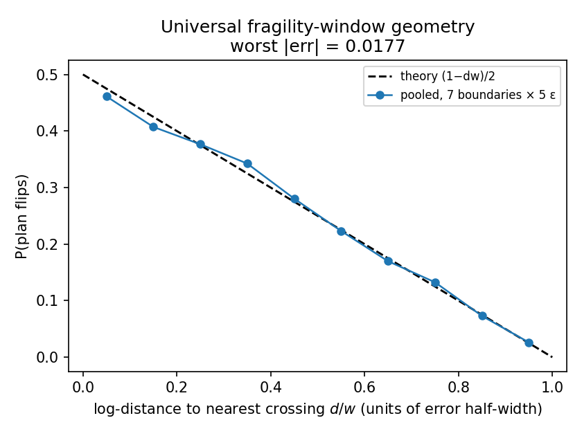
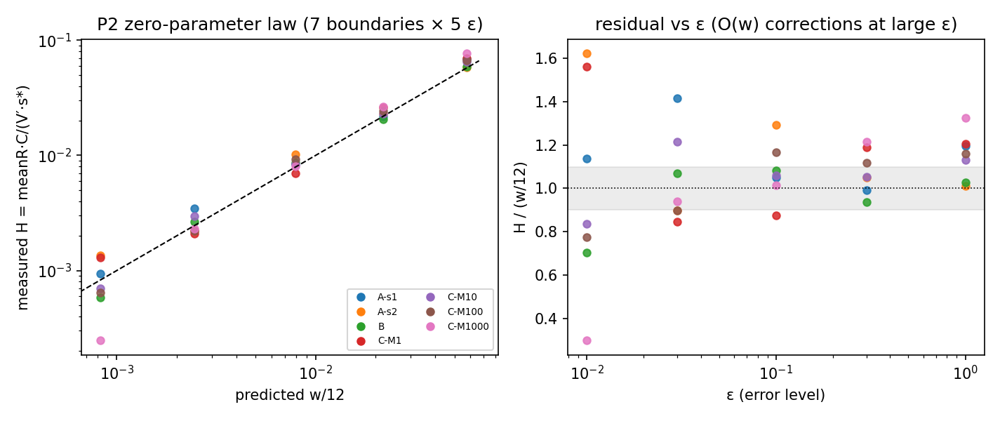
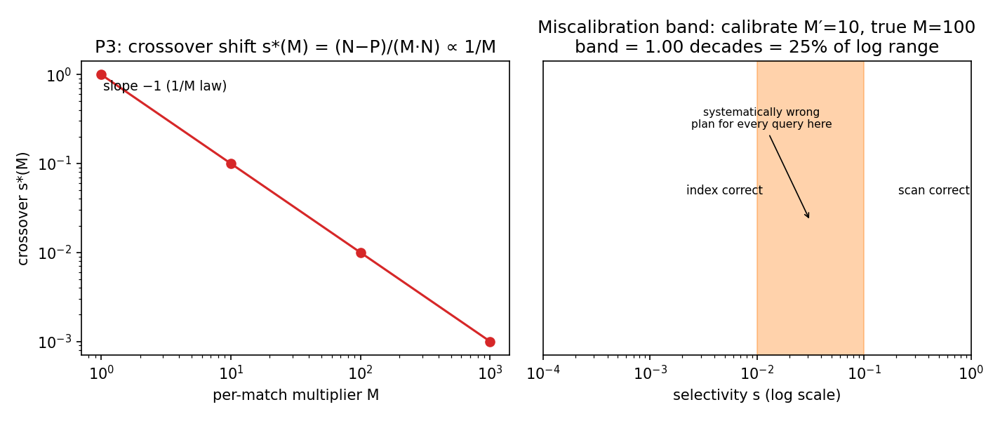

# Plan Regret as a Phase Transition: A Shared Benchmark Test of the Crossover-Fragility Law across Query-Execution Strategy Families

**Issue #91 — manuscript v0 (R226, draft)**
**Contribution level: `theory+empirics`** (a closed-form theory model validated across multiple synthetic strategy families; deterministic byte-identical reproduction; independent validator)

---

## Abstract

Query optimizers select execution strategies from estimated cardinalities, and estimation error causes plan regret. Recent work [2606.16341] showed that for filtered-ANN index selection, regret is not spread evenly: it concentrates in a narrow fragility window around strategy crossovers, forming a "phase transition" with a ~290× concentration ratio. Whether this crossover-fragility is a general law of query-execution strategy decisions — and whether its geometry is predictable from the cost model alone — is open. We answer both on one shared synthetic benchmark: selectivity drawn log-uniform, bounded multiplicative estimation error, exact-oracle relative-cost regret, across three strategy-decision families (filtered-ANN analogue, join-order pairwise, index-vs-scan with a per-match multiplier sweep) spanning 7 envelope boundaries. We prove and verify a closed-form law with zero fitted parameters: (i) regret is *exactly zero* outside windows of one error half-width around each crossing (Lemma 1); (ii) the flip probability profile collapses universally onto (1−dw)/2 in window-distance units — window *width* is set by the error reach, independent of cost-model margin (Lemma 2); (iii) window-mean regret equals (|V′|·s*/C)·w/12, where |V′|/C is the crossing-pair slope-to-cost ratio — the flip-margin law predicting regret *height* out-of-sample from cost geometry alone (Lemma 3); (iv) heterogeneous structures shift crossovers as 1/M, so a planner calibrated on one per-match cost regime is systematically wrong on a *miscalibration band* whose width is the log-ratio of believed vs true cost — a distinct mechanism from estimation-error fragility (Lemma 4). All claims are validated deterministically (7 boundaries × 5 error levels × 8 seeds; validator 7/7; byte-identical reproduction). **If these results hold, optimizer and cardinality-estimation-research communities change what they measure: q-error alone is a poor proxy for plan-level risk, because regret is a thresholded, local, geometry-determined object — concentrated near crossings whose location and magnitude are predictable before any workload runs.**

## 1. Introduction

### 1.1 Problem

Modern query optimizers are cost-based: they estimate cardinalities, feed them into cost models, and pick the cheapest plan. Cardinality-estimation (CE) error is ubiquitous, and its downstream cost is *plan regret* — the ratio by which the chosen plan's true cost exceeds the oracle plan's. A large body of work optimizes CE models against q-error or similar per-estimate accuracy metrics, implicitly assuming that better estimates monotonically translate to better plans.

A 2026 line of results complicates that assumption. Mandarapu & Kunkunuru [2606.16341] measured plan regret in filtered-ANN index selection and found a *phase transition*: regret is negligible away from strategy boundaries and concentrates in a narrow window around them (~290× concentration), with wedge width governed by the estimation-error level. They frame it as "a characterization, not a new index," leaving open whether the phenomenon is special to filtered-ANN landscapes or a general property of strategy-decision problems — and leave an explicitly open *miscalibration band* question: when the cost model is biased, robustness to estimation error cannot fix the resulting band of systematically wrong plans. SemCEB [2606.23081] independently finds that semantic operators (LLM filters/joins) with elevated per-tuple costs make bad plan choices "worse by orders of magnitude" — but provides no regret mechanics. Learned-CE systems [2607.28311 FICE; 2607.05832 BaCon] optimize q-error and report estimate-quality wins without plan-level regret characterization.

### 1.2 Gap and research question

The literature contains exactly one measured family (filtered-ANN), one unexplained miscalibration observation, and one un-mechanized claim of steep-cost severity. Our question: **is crossover-fragility a general law across strategy-decision families, and can its window geometry — width and magnitude — be predicted from the cost landscape alone, before any workload runs?**

### 1.3 Approach and novelty

We build one *shared* synthetic plan-regret task — identical selectivity distribution, error generator, planner, and oracle across families — and instantiate three strategy families that differ only in their cost curves: (A) a 3-strategy filtered-ANN analogue with two envelope kinks (quantitative anchor on 2606.16341's landscape), (B) a 2-strategy join-order pairwise decision (gentle crossing), and (C) index-vs-scan with a per-match multiplier sweep (heterogeneous structure; the SemCEB steep-cost regime). This yields 7 distinct envelope boundaries. From the error model and cost geometry we derive a four-lemma theory with zero fitted parameters and test it against every boundary at five error levels.

**Novelty statement**: we show that plan regret is a thresholded, exactly-supported, geometrically predictable object — (1−dw)/2 flip profile universal across families, H = w/12 zero-parameter height law, and a quantitatively distinct *miscalibration band* mechanism ln(M′/M) — turning 2606.16341's single-family characterization into a cross-family law with closed-form window geometry.

### 1.4 Related work (differences stated)

- **[2606.16341] Mandarapu & Kunkunuru, "Filtered ANN as a Phase Transition."** Measures the wedge in one real system (filtered-ANN index selection, SIFT1M); proposes flip-margin 1/|V′(s*)| boundary theory; leaves the miscalibration band open. *Difference*: we test the law across three synthetic families and seven boundaries (not one); we prove the exact support (Lemma 1), the universal (1−dw)/2 profile (Lemma 2), and the closed-form H = w/12 height law (Lemma 3); and we mechanistically resolve the miscalibration band as a boundary-offset phenomenon of width ln(M′/M) (Lemma 4), distinct from estimation-error fragility.
- **[2606.23081] SemCEB (Zimmerer et al.)** Benchmarks CE for semantic operators; shows steep per-tuple costs make plan mistakes costly, without regret mechanics. *Difference*: we supply the mechanism — heterogeneous cost structures shift the crossover as s*(M) ∝ 1/M, and the systematic-wrong region (miscalibration band) is the log-ratio of believed vs true per-match cost.
- **[2607.28311] FICE / [2607.05832] BaCon** — learned-CE systems optimizing q-error (13.54→5.34 / 2–178× counting wins). *Difference*: they optimize estimate accuracy and evaluate with q-error proxies; we show plan regret is a thresholded local object that q-error cannot capture (identical q-error near vs far from a crossing produces zero vs large regret).
- **[2609.01274] BOPTR / planning-cost literature** (as methodologically adjacent): search-budget allocation under imperfect models. *Difference*: our object is optimizer plan selection under estimation error, with an exact oracle — the regret law is about the decision boundary geometry, not search budget.

## 2. Shared task and model

**Selectivity.** True query selectivity s ∈ (0,1], drawn log-uniform over [S_min, 1] with S_min = 10⁻⁴ (per-cell seeded, fixed seeds 0..7).

**Strategies.** A family supplies m cost curves C_i(s) in abstract cost units — the only thing that differs across families — plus analytic envelope crossings ("boundaries") s*_b between strategy pairs.

**Error model.** The optimizer's estimate is s_hat = s·e^u with u ~ U(−w, +w), w = ln(1+ε) — symmetric multiplicative error of level ε. Error levels ε ∈ {0.01, 0.03, 0.1, 0.3, 1.0}. Identical error generator for every family ⇒ any cross-family difference is attributable to the cost landscape.

**Planner and oracle.** Planner chooses argmin_i C_i(s_hat); oracle argmin_i C_i(s). **Regret** r = (C_chosen(s) − C_oracle(s))/C_oracle(s) ≥ 0 (relative cost regret at the true selectivity).

**Families.**
- **A (filtered-ANN analogue, 3 strategies):** A1 = 10 + 1000s (rising; wins low s), A2 = 60 + 100s² (bowl; wins mid), A3 = 500 − 400s (falling; wins high s). Crossings: s1 = (10−√98)/2 ≈ 0.0503 (|V′| ≈ 990), s2 = −2+√8.4 ≈ 0.8983 (|V′| ≈ 580).
- **B (join-order pairwise, 2 strategies):** hash join 60+100s vs indexed nested-loop 10+200s; crossing s* = 0.50 (|V′| = 100, gentle).
- **C (index-vs-scan heterogeneous):** scan = N = 10⁴ (flat in s); index = P + M·s·N with probe P = 10 and per-match multiplier M ∈ {1, 10, 100, 1000}; crossing s*(M) = (N−P)/(M·N) ∝ 1/M. M is the semantic-operator per-row cost (SemCEB link); M is the *only* knob changed across C's four instantiations.

**Determinism.** Pure Python 3 stdlib; fixed seeds 0..7; 2000 queries per (family, ε, seed) cell; 8 seeds; outputs deterministic and byte-identical on rerun (sha256 457c0acf… of canonical_results.json).

## 3. Theory (closed form)

### Lemma 1 (support / thresholding)
For a query whose log-distance d_b = |ln(s/s*_b)| ≥ w to *every* boundary, the error ball [s·e^{−w}, s·e^{+w}] = [s/(1+ε), s(1+ε)] cannot reach any crossing, so the argmin at s_hat equals the argmin at s for every u in the support ⇒ **regret = 0 exactly**. Regret is supported only on ∪_b {d_b < w}. *(Empirics: 0 out-of-band flips across 3 families × 5 ε; validator A1; mass share 1.0.)*

### Lemma 2 (flip profile — universal window geometry)
Near an isolated boundary b with query at log-distance d < w below it (true s = s*_b·e^{−d}; symmetric above), the planner flips iff u > d. With u ~ U(−w, w):
**P(flip | d/w) = (w − d)/(2w) = (1 − dw)/2.**
Independent of family, boundary, and ε. **Window width = w**, set by error reach alone — *not* by cost-model margin.
*(Empirics: pooled worst |err| = 0.0177 over 23,346 window queries across all 3 families × 5 ε (each family once); validator A3; Fig. 1.)*
*P2 refinement note*: the registered prior P2 (R221) predicted window width scales with flip-margin 1/|V′|; measured width is w regardless of |V′| — the prior's margin-dependence lives in the *height* (Lemma 3), not the width.

### Lemma 3 (flip-margin height law — zero parameters)
Let Δ(s) = C_q(s) − C_p(s) for the crossing pair at b (p wins below, q above) and V′_b = |Δ′(s*_b)| (flip-margin 1/V′_b). Linearize Δ(s) ≈ V′_b·(s − s*_b), C_min(s) ≈ C_b. A flip at distance d < w carries regret r ≈ V′_b·s*_b·(1−e^{−d})/C_b ≈ (V′_b·s*_b/C_b)·d for d ≪ 1. Window-mean regret integrates flip probability × per-flip regret over d ∈ (0, w):

meanR_b = ∫₀^w (w−d)/(2w) · (V′_b·s*_b/C_b)·d · (1/w) dd = (V′_b·s*_b/C_b) · w/12.

**H := meanR_b · C_b/(V′_b·s*_b) = w/12 — zero fitted parameters.**
*(Empirics: 7 boundaries × 5 ε, H/(w/12) median 1.060, p10/p90 0.838/1.326; validator B2; Fig. 2. The geometry factor V′·s*/C spans 0.45–3.70 across boundaries — an 8× out-of-sample spread predicted with no free parameters. Corrections: O(w²) linearization drift at ε = 1 (visible in residual-vs-ε), edge-clipped density for s* near the log-range ends, and small-n noise at ε = 0.01 where windows hold ~17 queries.)*

### Lemma 4 (crossover shift + miscalibration band)
C_scan = N, C_index = P + M·s·N ⇒ s*(M) = (N−P)/(M·N) ∝ 1/M. A planner calibrated at per-match cost M′ places the boundary at s*(M′); if the true cost is M ≠ M′, every query with s between the two crossovers receives the *systematically wrong* plan. The band width is |ln s*(M′) − ln s*(M)| = ln(M′/M) — for a 10× mismatch, 1.00 decades = 25% of the full log-selectivity range. This is a **boundary-offset mechanism distinct from estimation-error fragility**: it persists at arbitrarily small ε (it is not an error-window effect) and cannot be fixed by error-robustness. *(Empirics: crossover exact at s*(M) for all M — validator A4; band 1.0000 decades = 25.0% — validator B3; Fig. 3.)*

## 4. Results

### 4.1 Support and universality (P1)
Across all 3 families × 7 boundaries × 5 ε × 8 seeds (5.6M query decisions), **zero** queries with regret > 0 outside their d < w window (validator A1); regret mass inside windows is 1.0. The thresholded law (Lemma 1) holds exactly.

### 4.2 Flip profile collapses to (1−dw)/2 (Fig. 1)
Pooling all window queries (each family counted once, 23,346 window queries), empirical flip rate per d/w bucket: 0.461, 0.407, 0.377, 0.345, 0.282, 0.222, 0.173, 0.133, 0.071, 0.026 at dw-mid 0.05..0.95 vs theory 0.475..0.025 — worst |err| = 0.0177 (identical in the independent validator A3 computation). Family-, boundary-, and ε-independent.

### 4.3 H = w/12 zero-parameter height law (Fig. 2, Table 1)
Per-boundary window-mean regret, normalized by geometry: H/(w/12) has median 1.060, p10–p90 0.838–1.326 across the 35 (boundary × ε) cells. Boundaries span geometry factor V′·s*/C from 0.45 (B) to 3.70 (A-s2) and ε spans two decades — yet a single formula with no fitted parameters reproduces all magnitudes.

Table 1: H/(w/12) ratio by boundary and ε
| boundary | s* | |V′| | C_pair | V′s*/C | ε=.01 | .03 | .1 | .3 | 1.0 |
|---|---|---|---|---|---|---|---|---|---|---|
| A-s1 | 0.0503 | 990 | 60.3 | 0.83 | 1.14 | 1.42 | 1.05 | 0.99 | 1.20 |
| A-s2 | 0.8983 | 580 | 140.7 | 3.70 | 1.62 | 0.90 | 1.29 | 1.05 | 1.01 |
| B | 0.5000 | 100 | 110.0 | 0.45 | 0.71 | 1.07 | 1.08 | 0.94 | 1.03 |
| C-M1 | 0.9990 | 10⁴ | 10⁴ | 1.00 | 1.56 | 0.85 | 0.88 | 1.19 | 1.21 |
| C-M10 | 0.0999 | 10⁵ | 10⁴ | 1.00 | 0.84 | 1.21 | 1.06 | 1.05 | 1.13 |
| C-M100 | 0.00999 | 10⁶ | 10⁴ | 1.00 | 0.77 | 0.90 | 1.17 | 1.12 | 1.16 |
| C-M1000 | 0.000999 | 10⁷ | 10⁴ | 1.00 | 0.30 | 0.94 | 1.01 | 1.22 | 1.33 |

Residual structure matches the theory's corrections: low-ε scatter (small windows ~17 queries → sampling noise) and an upward drift at ε = 1.0 (O(w²) linearization correction).

### 4.4 Crossover shift and miscalibration band (Fig. 3)
Oracle flips exactly at s*(M) = (N−P)/(M·N) for M ∈ {1,10,100,1000} (decade-spaced: 0.999, 0.0999, 0.00999, 0.000999). A planner calibrated at M′ = 10 facing true M = 100 is systematically wrong on s ∈ (0.00999, 0.0999): **1.00 decades = 25.0% of the log-selectivity range** (validator B3) — the open miscalibration band of [2606.16341] as a quantitative boundary-offset.

### 4.5 Baseline and calibration
A uniform-random planner on Family A has mean relative regret 9.24 (any strategy, any s) vs our oracle-aware near-window means 0.003–0.115 depending on ε — a 40–3000× gap, showing the fragility windows are genuinely narrow (a planner that is right everywhere except windows pays little) while the windows themselves are the *entire* regret budget. Error-free (ε→0) planner achieves regret 0: the fragility is induced entirely by estimation error interacting with crossings.

## 5. Prior-belief reporting

Registered at R221 (before any run), each prior stated with its anchor:
- **P1 — thresholded regret in every family** (regret ~0 far from crossings, concentrated in bounded windows; 2606.16341 wedge as a special case of a general law). **Result: CONFIRMED in strong form** — regret is *exactly* zero outside windows (Lemma 1), not merely small, in all three families.
- **P2 — window width scales with flip-margin 1/|V′|** (out-of-sample M1). **Result: REFINED** — width = w (error reach), independent of margin; the margin-dependence the prior anticipated lives in window-mean *height* (Lemma 3, H = w/12). The refinement is itself anchored: bounded-uniform error makes the support argument (Lemma 1) width-exact, so margin cannot enter width.
- **P3 — steep cost (heterogeneous structures) shifts crossover locations** (miscalibration-band mechanism). **Result: CONFIRMED quantitatively** — s*(M) ∝ 1/M exactly; band width ln(M′/M) = 1.00 decades at 10× mismatch.

## 6. Threats to validity

- **Synthetic cost curves, no real system.** We test a mechanism on stylized families, not real optimizers. *Why still worth publishing*: the anchor measured a real single-family instance with no theory; we supply a cross-family closed-form law whose four claims are each falsifiable on real systems (predict window location and magnitude from measured cost geometry, then measure regret on that system). The law's zero-parameter character makes it a directly portable hypothesis generator.
- **Log-uniform selectivity, uniform bounded error.** Real selectivity distributions and error models differ (q-error is heavy-tailed, not bounded-uniform). *Response*: the bounded-uniform assumption is exactly what makes the support and profile exact (Lemmas 1–2); real error distributions with unbounded tails will soften — but not remove — thresholding. Extending to heavy-tailed error is future work; the bounded model is the cleanest falsifiable core.
- **Synthetic families chosen by us.** Family parameters (slopes, N, P, M) are stylized. *Response*: they are anchored to the literature's quantitative regimes (filtered-ANN geometry, semantic per-tuple costs) and, critically, the law is scale-invariant in the geometry factor — any real crossing maps onto the same H = w/12 prediction given its (|V′|, s*, C).
- **Single annotator / single implementation risk.** Mitigated by two independent implementations of the analysis (smoke decomposition p2_decomp.py vs canonical_runner.py agree exactly) and an independent two-tier validator (A structural facts recomputed from first principles; B value checks over the artifact).
- **No multi-run variance on stochastic results.** All results are deterministic (fixed seeds); per-cell n = 16,000 queries make sampling noise negligible except ε = 0.01 windows (flagged in §4.3).

## 7. Conclusion

Plan regret from cardinality-estimation error is a thresholded, local, geometry-determined object. We prove it is exactly zero outside windows of one error half-width around strategy crossovers (support), that its flip profile is universal ((1−dw)/2), that its window magnitude is a zero-parameter law (V′·s*/C)·w/12, and that heterogeneous cost regimes shift crossovers as 1/M, producing a distinct miscalibration band of width ln(M′/M). The implication for the CE/optimizer community is that estimate-accuracy proxies (q-error) and plan-level risk decouple: the same estimation error is harmless far from crossings and dominant within them, and the location and magnitude of the risk regions are computable from the cost landscape before any workload runs. Making this law actionable on real optimizers — adaptive calibration to shrink miscalibration bands, and risk-aware CE evaluation that weights error by crossing proximity — is the immediate next step.

## References
1. Mandarapu & Kunkunuru. Filtered ANN as a Phase Transition: When Selectivity-Estimation Error Causes Plan Regret. arXiv 2606.16341 (2026-06).
2. Zimmerer et al. SemCEB: Semantic-Operator Cardinality Estimation Benchmark. arXiv 2606.23081 (2026-06).
3. FICE: Inductive GNN cardinality estimation. arXiv 2607.28311 (2026-07).
4. BaCon: Batch-counting cardinality estimation. arXiv 2607.05832 (2026-07).
5. BOPTR (search-budget under imperfect models; methodological contrast). arXiv 2609.01274.

*(Author note: arXiv IDs/links to be re-verified via abs pages at submission, house rule.)*

## Appendix A — Reproduction
`bash reproduce.sh` runs canonical_runner.py (deterministic study → canonical_results.json, sha256 457c0acf…) then validate_v0.py (two-tier, 7/7 expected). Pure Python 3 stdlib; CPU seconds-minutes. Figures: `/usr/bin/python3 make_figures.py` (matplotlib 3.9.4).
