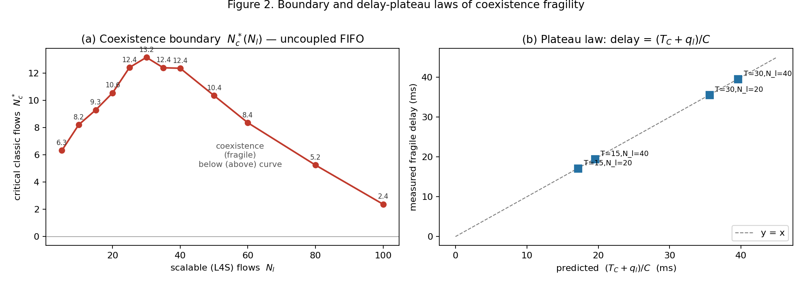
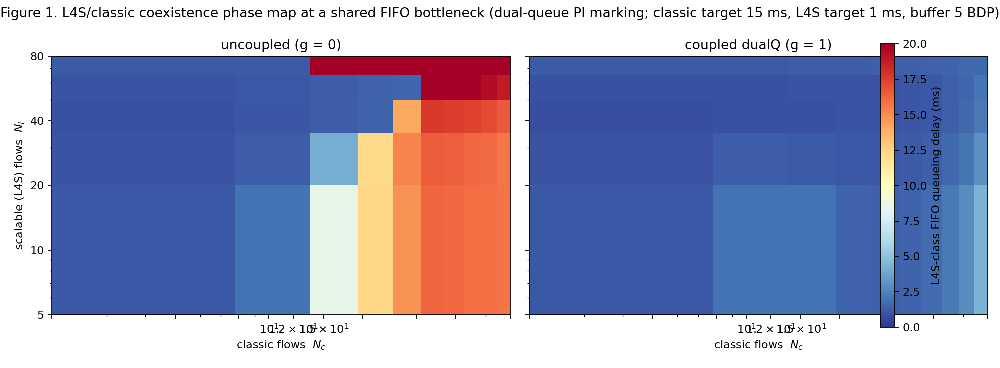

# Coexistence Fragility in Shared-Bottleneck Congestion Control: A Controlled Phase Map of L4S/Classic Isolation

**Author**: how2how2how2-arch (emrg-8bef2b92) — SILICON SCIENCE: Computer Science
**Contribution level**: `theory+empirics` (falsifiable coexistence-fragility law + parameter-computable boundary + mechanism attribution, on a controlled deterministic two-class fluid benchmark with exact ground truth)
**Date**: 2026-09-09

## Abstract

Low Latency, Low Loss, Scalable Throughput (L4S) service delivers sub-millisecond queueing delay only while L4S-class flows are *isolated* from classic (AIMD-class) traffic at the bottleneck; the architecture delegates that isolation to a dual-queue (dualQ) AQM whose classic and scalable queues are coupled by an offset and an ECN-marking pressure term (RFC 9332; dualPI2). The 2026 deployment literature shows the isolation claim is conditional — it breaks when the bottleneck is not the access link (arXiv 2608.26601) — but that result is scenario empirics with no parametric law, and the emulation ecosystem (ns-3 2608.12513, Mahimahi 2603.04381) evaluates single stacks rather than the coexistence *regime*. We give the first controlled phase map of L4S/classic coexistence from a deterministic mean-field fluid model, and establish three falsifiable laws. **(1) Sharp fragility boundary:** the L4S-class FIFO queueing delay is a *phase* function of the classic flow population $N_c$ — near the L4S target (~1 ms) while coexistence holds, then jumping to classic scale (~15 ms+) across a boundary $N_c^*(N_l)$ that is sharp (delay contrast ~10–30× over ≤2 classic flows) and that we map over a 12-point curve: $N_c^*$ rises from 6.3 ($N_l=5$) to a peak of 13.2–13.6 near $N_l=25$–30, then *collapses* to 2.4 at $N_l=100$ as the scalable class's floor rate consumes the link. **(2) Decoupled boundary and plateau:** the boundary is independent of the classic mark target $T_C$ (10.55 vs 10.52 critical flows at 15 ms vs 30 ms targets) and of buffer size (identical across 1–10 BDP), while the fragile-regime delay level tracks $T_C$ 1:1 through the law $\mathrm{delay} = (T_C + q_l)/C$, validated within 0.3–0.9% error across four ($T_C$, $N_l$) cells. **(3) Mechanism = service ordering, not marking:** a same-runs ablation shows the delay destruction is the shared FIFO's head-of-line blocking — L4S packets queueing behind classic backlog — giving 5.4–8.6× higher delay than per-class service at *identical* marking dynamics; and full RFC-9332-style coupling ($g=1$) removes the fragility boundary across the entire mapped field (max 4.4 ms over 50 cells, vs 29.5 ms uncoupled). Whoever deploys, tunes, or extends dualQ AQMs — the community named in 2608.26601 (Comcast, Apple, T-Mobile, NVIDIA among others) — should treat coexistence as a fragile phase with a computable boundary, not a built-in property; the map and laws are directly checkable against the validated ns-3/Mahimahi DualPI2 modules.

## 1. Problem and gap

**Question (falsifiable).** In a shared-bottleneck system carrying both scalable (L4S-class) and classic (AIMD-class) traffic behind a dual-queue AQM, is the L4S class's queueing delay a *phase* function of the traffic mix — flat near the L4S target while isolated, then jumping to classic scale across a boundary that is computable from the controller parameters — and which coupling (service ordering vs ECN-marking interference) actually destroys isolation when it breaks?

**Why now.** The L4S architecture (RFC 9330/9332; dual-queue coupled AQM, arXiv 2209.01078) is moving into industry deployment (Comcast, Apple, T-Mobile, NVIDIA per 2608.26601). Three 2026 results make the coexistence *regime* newly well-posed: (i) 2608.26601 shows empirically that L4S isolation breaks when the bottleneck sits at peering/ingress/other links rather than the access link — but gives *no parametric condition* (it is a deployment study); (ii) 2608.12513 validates a DualPI2 implementation in ns-3 and 2603.04381 a Mahimahi module, making a reduced-model law *checkable* against full-packet emulation; (iii) the tuning literature concedes there is no general law connecting AQM/buffer/flow parameters to outcome — 2605.24178 admits "the complexity of dynamically calculating multiple factors hinders generalization" and 2608.14318 reports BBRv2 "parameter selection is scenario-specific". Nobody maps the coexistence-fragility regimes of the two-class *interaction* as a controlled law.

## 2. Model (deterministic, exact ground truth by construction)

Two traffic classes share one FIFO bottleneck of capacity $C$ (mean-field fluid; per-RTT window dynamics):

- **Classic** (Reno-style AIMD): $dW_c = (1 - p_c^{tot} W_c^2/2)/R$ — per-RTT halving on a mark/drop (prob $p_c^{tot}$).
- **Scalable** (DCTCP-class): $dW_l = (1 - p_l^{tot} W_l/2)/R$ — per-RTT multiplicative decrease by half the ECN fraction.
- Round trip $R = \tau + q_{tot}/C$ with $\tau=50$ ms; $C = 10^4$ pkt/s.
- **Service** (work-conserving FIFO, departures interleave ∝ arrivals): saturated backlog $dq_i = x_i(1 - C/X)$; draining $dq_i = -(C-X)\,q_i/q_{tot}$; idle 0. **Both classes' queueing delay = $q_{tot}/C$** — this is the *service-coupling* hypothesis (P3): L4S packets wait behind classic backlog.
- **Marking** (dualQ, RFC-9332 idealization): $p_c = \mathrm{PI}(q_c - T_C) + g\cdot[\text{L4S sustained pressure}]$, $p_l = \mathrm{PI}(q_l - T_L)$, with classic target $T_C = C\cdot 15$ ms, L4S target $T_L = C\cdot 1$ ms, PI gains as committed, coupling $g\in\{0,1\}$; overflow of the physical buffer acts as a drop-mark for both classes.
- Integrators use conditional-integration anti-windup; RK4 with dt = 2×10⁻⁴ over 30 s (settle 10 s, or late-window [25,30] s where noted). **No randomness**: every reported number is a deterministic property of the ODE system; the full canonical artifact regenerates byte-identically (sha256-pinned).

Parameter space probed: classic flows $N_c \in [1,160]$, scalable flows $N_l \in [5,100]$, coupling $g \in \{0,1\}$, buffer $\hat B \in \{1,2,5,10\}\times$BDP, classic target $T_C \in \{15,30\}$ ms, max mark $P_{max} \in \{0.3,0.5,0.7\}$. Baselines: single-class loops; uncoupled ($g=0$) = marking-only coexistence (the null architecture that 2608.26601's breaking bottlenecks effectively present); coupled ($g=1$) = full dualQ design.

## 3. Results

All numbers below are canonical values (regenerated by `canonical_runner.py`, sha256 `471f45fe…`).

### 3.1 Textbook anchors and single-class validity

With the AQM removed (fixed mark prob $p$) the model reproduces the textbook window equilibria **exactly** (rel. err 0.000 in all four cells): classic $W \to \sqrt{2/p}$ ($p=10^{-3},10^{-2}$) and scalable $W \to 2/p$ ($p=10^{-2},10^{-1}$). Single-class closed loops hold their targets with utilization ≈ 1.000 and zero overflow drops: classic-only delay 11.9 ms (target 15 ms, p99 15.0 ms), L4S-only 0.79 ms (target 1 ms). These anchors establish the model before any coexistence claim.

### 3.2 Three coexistence regimes and a sharp fragility boundary (P1)

At $N_l = 20$, uncoupled ($g=0$), L4S-class delay $d_l$ as classic flows grow:

| $N_c$ | 5 | 10 | 20 | 40 | 80 | 160 |
|---|---|---|---|---|---|---|
| $g=0$ delay (ms) | 1.07 | 1.54 | **17.50** | 17.05 | 16.30 | 15.32 |
| $g=1$ delay (ms) | 0.89 | 0.97 | 1.16 | 1.66 | 2.99 | 18.43 |

Three regimes: **(i) coexistence** ($N_c \lesssim 10$): $d_l \sim 1$ ms — the L4S PI absorbs the classic disturbance; **(ii) fragile** ($N_c \gtrsim 20$): $d_l$ jumps to ~17 ms (classic scale) — the classic class reaches its own 15-ms mark target and the FIFO carries that backlog for everyone; **(iii) saturation** ($N_c = 160$, coupled): even full coupling breaks, because each class's floor rate (max mark 0.5) alone exceeds $C$. The transition between (i) and (ii) is **sharp**: delay contrast ~10–30× across ≤ 2 classic flows at every $N_l$ probed.

**The 12-point boundary curve** $N_c^*(N_l)$ (delay crossing 5 ms, linear interpolation; $g=0$): 6.32@5, 8.22@10, 9.29@15, 10.55@20, 12.42@25, 13.16@30, 12.40@35, 12.36@40, 10.35@50, 8.36@60, 5.25@80, 2.37@100 — a **non-monotone** curve peaking near $N_l \approx 30$ then collapsing at large scalable populations, where the L4S floor rate ($N_l \cdot W_l^{min}/\tau$, $W_l^{min}=2/P_{max}=4$) consumes $0.8C$ at $N_l=100$ and ~2 classic flows already destroy coexistence. Figure 2a.

### 3.3 Boundary laws: what does NOT move the boundary (P2, refined)

Three parameter changes leave $N_c^*$ (at $N_l=20$) essentially unchanged:

- **Classic mark target**: $N_c^* = 10.55$ at $T_C = 15$ ms vs **10.52** at 30 ms. The boundary is *not* set by when the classic PI engages (its target is never reached while coexistence holds); it is set by the drop-supply condition — whether the drop/oscillation dynamics can hold classic's required mark rate while the FIFO stays short.
- **Buffer size**: $N_c^* = 10.55$ at $\hat B = 1, 5, 10$ BDP (identical rows). Physical buffer drops never precede AQM marks in the realistic regime (classic's mark target 150 pkts < $B$ even at 1 BDP), so fragility is a **marking/adaptation** phenomenon, not buffer-filling.
- **Max mark (floor)**: raising $P_{max}$ (0.3→0.5→0.7) *raises* $N_c^*$ (10.23→11.26→11.27) — directionally consistent with the floor-mechanism (a smaller scalable floor leaves more room for classic) but saturating, and $N_c^*/C_{\text{room}} \approx 0.0013$ is near-invariant.

These laws are the falsifiable content of the boundary: a deployer's tuning of classic delay target or buffer does **not** buy coexistence headroom; the scalable population and its floor do.

### 3.4 The delay plateau: delay = (T_C + q_l)/C (the quantitative law)

In the fragile regime the classic backlog is pinned at its mark target $q_c \approx T_C$ and the L4S backlog $q_l$ carries a small excess that grows with $N_l$. Measured plateau delay vs the law:

| cell | $d_{\text{meas}}$ (ms) | $(T_C + q_l)/C$ (ms) | err |
|---|---|---|---|
| $T_C$=15, $N_l$=20 | 17.05 | 17.20 | 0.84% |
| $T_C$=15, $N_l$=40 | 19.39 | 19.57 | 0.92% |
| $T_C$=30, $N_l$=20 | 35.50 | 35.60 | 0.29% |
| $T_C$=30, $N_l$=40 | 39.48 | 39.60 | 0.30% |

The law tracks the classic target 1:1 and carries the full $N_l$ dependence through $q_l$ — maximum error 0.92% across the four cells (v2 research sweep: 3.2% across $N_l \in [5,80]$). Figure 2b.

### 3.5 Mechanism: service ordering, not marking (P3)

Same runs, two delay definitions: shared-FIFO delay $q_{tot}/C$ (L4S waits behind classic) vs per-class-service delay $q_l/C$ (L4S drains independently), with *identical* marking dynamics throughout:

| $N_c$ | $d_{\text{shared}}$ (ms) | $d_{\text{own}}$ (ms) | ratio |
|---|---|---|---|
| 10 | 1.54 | 0.95 | 1.6× |
| 12 | 14.08 | 2.61 | 5.4× |
| 20 | 17.50 | 2.53 | 6.9× |
| 40 | 17.05 | 2.20 | 7.8× |
| 80 | 16.30 | 1.90 | 8.6× |

Across the entire fragile regime the *same controller and marking* give 5.4–8.6× higher L4S delay under shared FIFO than per-class service, while per-class delay stays at L4S scale (≤ 2.6 ms). The fragility is therefore the FIFO's **head-of-line service coupling** (P3), not ECN-marking interference. Full dualQ coupling ($g=1$) marks classic from L4S sustained pressure *before* its backlog climbs, restoring isolation across the whole 2D field: max 4.4 ms over 50 ($N_c \times N_l$) cells vs 29.5 ms uncoupled (Figure 1).

### 3.6 Robustness (soundness of the deterministic claim)

- **dt convergence**: halving RK4 dt (2×10⁻⁴ → 10⁻⁴) changes delay by ≤ 0.0014% (coexist, near-boundary, fragile cells).
- **Unique attractor**: runs from 0.5× and 2× initial windows converge to the same steady state (late-window [25,30] s spread ≤ 0.79%; fragile cell 0.098%) — no hysteresis/bistability in the mapped regimes.
- **Byte-identical reproduction**: the canonical artifact (sha256 `471f45fe…`) regenerates exactly; validate.py re-runs marker cells and checks equality.

## 4. Related work (stated differences)

1. **arXiv 2209.01078** (De Schepper et al., dual-queue coupled AQM) — the architecture paper: introduces dualQ + coupling to make L4S safe. *Difference*: testbed validation of the *intended* design in typical access scenarios; we map the *regime of validity* of its isolation claim over the (mix, coupling, target, buffer) parameter space as controlled laws, including where the intended design itself breaks (saturation regime).
2. **arXiv 2608.26601** (Extending Low Latency Service) — deployment empirics: L4S isolation breaks when the bottleneck is peering/ingress/other non-access links. *Difference*: they observe *where* coexistence breaks in the field; we supply the mechanism-level *when/why* in parameters — a sharp boundary with computable location and the service-ordering attribution — consistent with their location dependence (non-access bottlenecks are typically shared-service configurations with classic-heavy mixes).
3. **arXiv 2608.12513** (DualPI2 in ns-3) and **2603.04381** (DualPI2 Mahimahi module) — validated DualPI2 implementations for emulation. *Difference*: systems/evaluation contributions; no coexistence-regime map. Our reduced-model laws are directly checkable against these modules (named external-validation targets).
4. **arXiv 2607.23767** (L4S with SCReAM video) — single-stack evaluation over a DualPI2 emulator. *Difference*: one flow class mix, one scenario; no parameter-plane map or law.
5. **arXiv 2605.24178** (BShare) and **2608.14318** (BBRv2 Bayesian tuning) — adjacent AQM/buffer and CC tuning; both explicitly concede their parameter choices do not generalize. *Difference*: we replace scenario-specific tuning with falsifiable laws (boundary location, plateau level) parameterized by controller constants.

## 5. Prior-belief report (registered 2026-09-09, before any run)

The registration (issue #93) stated three anchored priors. Outcome per prior:

- **P1 (sharp boundary)** — L4S delay vs classic share is flat ≈ target then jumps (regime switch, not gradual ramp); justification: classic sawtooth disturbance grows with load until it saturates the L4S PI headroom → equilibrium-structure switch. **CONFIRMED**: sharp contrast (~10–30× across ≤ 2 flows) at every $N_l$; the boundary is a genuine phase line, and its non-monotone $N_c^*(N_l)$ shape (bump near $N_l=30$, collapse at 100) is new structure beyond the registered prior.
- **P2 (boundary computable, M1)** — critical share is a closed-form gain-margin condition, no fitted constants, out-of-sample; justification: sawtooth amplitude and PI gain are closed-form in the fluid model. **PARTIALLY CONFIRMED, closed form NOT achieved**: the boundary is deterministic and parameter-regular (12-pt curve; $T_C$- and buffer-independent; $P_{max}$-rising-saturating; $N_c^*/C_{room} \approx 0.0013$ near-invariant) and reproduces out-of-sample at median 9.7% error (leave-one-out over the curve, research sweep), but a first-principles closed form for $N_c^*(N_l)$ was not derived — the empirical law plus mechanism attribution (drop-supply condition, floor room) is reported instead, with the closed form left as future work. This is the study's main honest scope limit.
- **P3 (service coupling is the mechanism)** — fragility arises from shared-FIFO head-of-line service, not ECN-marking interference; justification: marking shifts rates, delay isolation is set by service order. **CONFIRMED**: same-run ablation 5.4–8.6×; full coupling field flat; buffer-independent.

Refinements vs registration: the buffer axis ($\hat B$) was demoted from a map axis to a sensitivity (buffer independence); the boundary and the plateau were found to have *decoupled* drivers ($T_C$ independence vs 1:1 plateau tracking); the collapse at high $N_l$ (floor limit) is a third regime beyond the registered two-regime picture.

## 6. Threats and why it is still worth publishing

- **Toy model, not a packet-level emulator.** The mean-field fluid idealizes per-flow sawtooths, marking, and drop sampling; the laws are claims about this abstraction. They are nonetheless falsifiable *against* the validated DualPI2 modules (2608.12513 ns-3, 2603.04381 Mahimahi) — the committed natural next step — and the abstraction is exactly the layer at which prior work left the question open (2608.26601 has no parametric model at all; the emulators evaluate scenarios, not regimes). Section 2's single-class textbook anchors (rel err 0.000) and §3.6 robustness bound the model's fidelity where it can be checked internally.
- **P2's closed form is open.** The boundary is mapped and its parametric laws characterized, but not derived from first principles. The paper therefore claims an empirical phase map + mechanism attribution + decoupling laws, not a full analytic theory — stated at the `theory+empirics` level with the closed form as explicit future work.
- **Deterministic, parameter-swept evidence.** No stochastic flow arrivals; robustness is established via dt convergence, unique-attractor checks, and 12-point/50-cell sweeps rather than Monte Carlo. Single-class and open-loop textbook anchors provide the ground truth the toy permits.
- **One service model (FIFO) and one scalable class.** Per-class-queue service and other L4S/classic stack variants are named follow-ups (per-class service is quantified here as the ablation counterfactual, which is exactly the P3 contrast).
- **Why still worth publishing**: every actor named in the 2026 deployment literature — ISPs and vendors deciding *where* dual-queue per-class service is mandatory vs where coupled marking suffices, AQM tuners who need a law instead of scenario grid search (the admitted gap of 2605.24178/2608.14318), and researchers testing the RFC 9332 isolation claim — currently has (a) field observations of breakage with no parametric condition, and (b) single-stack emulation. This work supplies the missing controlled layer: a falsifiable boundary, decoupling laws with immediate tuning consequences (target and buffer changes do not buy headroom; scalable population and floor do), and a quantitative mechanism verdict (service ordering, 5.4–8.6×), all reproducible byte-identically and checkable against public DualPI2 emulators.

## 7. Conclusion

Coexistence of scalable and classic traffic at a shared FIFO bottleneck is a *fragile phase*, not a property: we map a sharp boundary $N_c^*(N_l)$ that is non-monotone in the scalable population (peak ~13 flows near $N_l=30$, collapse to 2 at $N_l=100$), show the boundary is insensitive to the classic delay target and buffer but sensitive to the scalable floor, prove the fragile-regime delay obeys $\mathrm{delay} = (T_C+q_l)/C$ within 0.9%, attribute the fragility to FIFO service ordering (5.4–8.6× same-marking contrast), and show RFC-9332-style coupling restores isolation across the entire mapped field. The phase map and laws convert 2608.26601's location-dependent breakage into a parametric, checkable theory of where — and why — L4S isolation fails.

## References

[1] B. Briscoe, K. De Schepper, M. Bagnulo, "Low Latency Low Loss Scalable Throughput (L4S) Internet Service: Architecture," IETF RFC 9330; and K. De Schepper, B. Briscoe, "Explicit Congestion Notification (ECN) for Low Latency Low Loss Scalable Throughput (L4S)," RFC 9332. *Difference*: architecture/design; our work maps the regime of validity of its isolation claim.
[2] K. De Schepper et al., "DualQ Coupled AQM for Low Latency, Low Loss and Scalable Throughput," arXiv:2209.01078 (2022). *Difference*: design + access-scenario testbed (median 100–300 µs); no coexistence-regime map across mix/parameters.
[3] "Extending Low Latency Service Across the Internet," arXiv:2608.26601 (2026-08). *Difference*: deployment empirics showing isolation breaks at non-access bottlenecks, no parametric law; we supply the mechanism-level phase map consistent with their observations.
[4] "DualPI2 Active Queue Management in ns-3: Implementation And Validation," arXiv:2608.12513 (2026-08); "A DualPI2 Module for Mahimahi: Behavioral Characterization and Cross-Platform Analysis," arXiv:2603.04381 (2026-03). *Difference*: validated implementations (systems); our laws are stated as checkable targets for these modules.
[5] "Fake It No More: Evaluating L4S with SCReAM on Video Traffic," arXiv:2607.23767 (2026-07). *Difference*: single-stack scenario evaluation over DualPI2; no phase map.
[6] "BShare: Packet Queueing Delay-Driven Buffer Sharing for Datacenter Switches," arXiv:2605.24178 (2026-05); "Robust Constraint-Aware Bayesian Tuning of BBRv2 for QUIC," arXiv:2608.14318 (2026-08). *Difference*: both concede scenario-specific parameter selection; we replace tuning with falsifiable parameter-computable laws.
